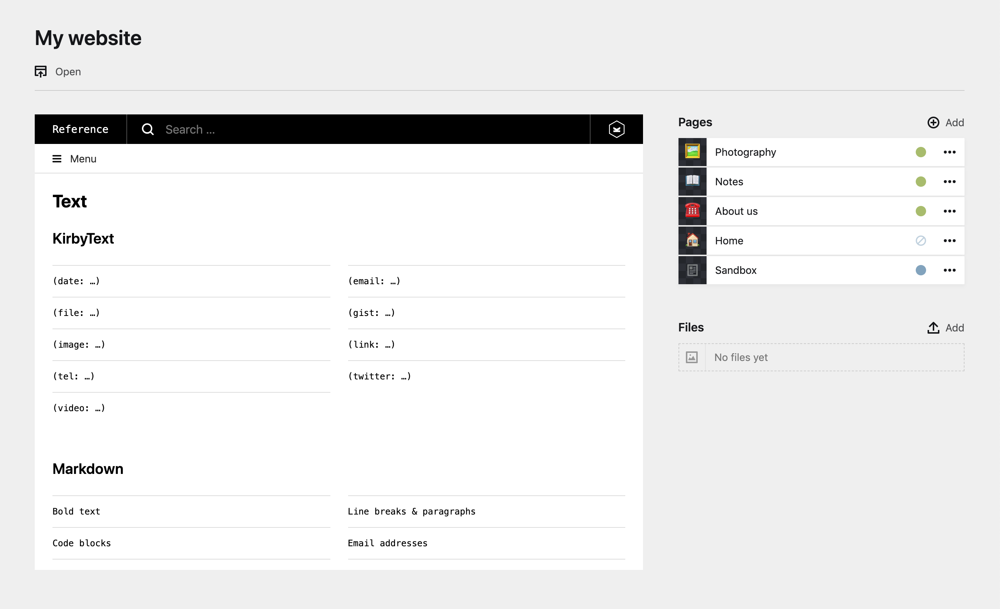

# kirby-iframe-field

A very simple field to display an iframe in the panel



## Installation

### Download

Download and copy this repository to `/site/plugins/iframe-field`.

### Git submodule

```
git submodule add https://github.com/arnaudjuracek/kirby-iframe-field.git site/plugins/iframe-field
```

### Composer

```
composer require arnaudjuracek/iframe-field
```

## Blueprint usage

```yaml
fields:
  webpage:
    type: iframe
    src: https://getkirby.com/
    ratio: 16/9
```

## Options

### `src: string`
The source of the iframe.

Can be either a relative path (if you want to display something related to the content of your website, a template, a panel page, etc…) or an absolute path (to display something related to another website, but be careful of CORS though).

### `ratio: fraction`
Default is `4/3`.

Define the aspect ratio of the iframe. Can be used in conjunction with the standard field `width` property.

## License

[MIT](https://tldrlegal.com/license/mit-license).
